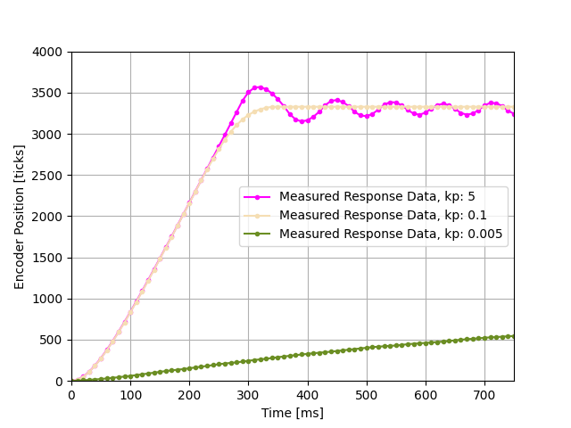

# me-405-lab3
This lab inlvoves the closed looped control of a DC motor and step-response analysis. 

The motor control utilizes motor driver, encoder reader, and controller classes along with a GUI for user control and visualization of the step-response data. 
The controller class utilizes P-control for motor position to controll PWM delivered to the motor. The formula for P-control is:
PWM=Kp*(setpoint-actual)
where "setpoint" is 1 full rotation and "actual" is the encoder reading from encoder class. The controller is updated at a frequency of 100 Hz. 

The GUI is a popup window which accepts user input for Kp values and graphs the motor position output verus time. The interface inludes a "clear" button to clear the graph, a quit window to close the program, a textbox to accept Kp value, and and  "enter Kp and run" button to run the step-response. Multiple step-repsonses can be visualized on the same graph by running mutiple Kp's. 

The step response testing inlvoved 3 different Kp values to show an overdamped system, an underdamped system, and a critically damped system. These results can be seen below in Figure 1. 

Figure 1. Step-response testing

